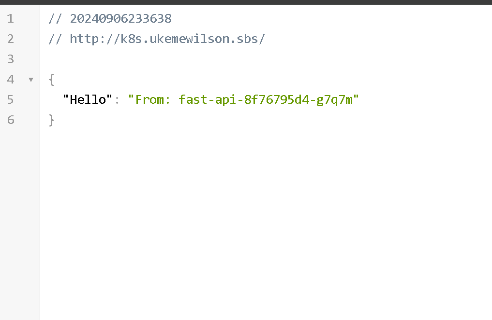

# FastAPI Kubernetes Deployment

This repository contains a FastAPI application that is containerized using Docker and deployed on a Kubernetes cluster. The application returns the hostname of the pod running the FastAPI app.

## Table of Contents
- [Prerequisites](#prerequisites)
- [Setup Instructions](#setup-instructions)
  - [Clone the repository](#clone-the-repository)
  - [Docker Setup](#docker-setup)
  - [Kubernetes Setup](#kubernetes-setup)
- [Environment Variables](#environment-variables)
- [Accessing the Application](#accessing-the-application)
- [Useful Commands](#useful-commands)

---

## Prerequisites

Before setting up this project, ensure you have the following installed:
- [Docker](https://www.docker.com/get-started)
- [Minikube](https://minikube.sigs.k8s.io/docs/start/) or any Kubernetes cluster
- [kubectl](https://kubernetes.io/docs/tasks/tools/)
- [Helm](https://helm.sh/docs/intro/install/) (for managing ingress)

---

## Setup Instructions

### Clone the repository

1. Clone this repository to your local machine:

    ```bash
    git clone https://github.com/bosukeme/k8s-fastapi.git
    cd k8s-fastapi
    ```

### Docker Setup

1. **Build the Docker image**:

    ```bash
    docker build -t <your-dockerhub-username>/fast-api:latest .
    ```

2. **Push the image to Docker Hub**:

    Make sure you're logged into Docker Hub:

    ```bash
    docker login
    ```

    Push the image to your Docker Hub repository:

    ```bash
    docker push <your-dockerhub-username>/fast-api:latest
    ```

### Kubernetes Setup

1. **Start Minikube**:

    Start Minikube with the following command (if you're using Minikube):

    ```bash
    minikube start
    ```

2. **Create the Kubernetes namespace**:

    ```bash
    kubectl apply -f kubernetes/namespace.yaml
    ```

3. **Deploy the FastAPI application**:
    Replace image name in kubernetes/deployment.yaml with your image

    Apply the deployment and service files:

    ```bash
    kubectl apply -f kubernetes/deployment.yaml
    kubectl apply -f kubernetes/service.yaml
    ```

    Verify that the deployment and service is running 

    Deployment:
    ```bash
    kubectl get deployments -n fast-api-ns
    ```

    Pods:
    ```bash
    kubectl get pods -n fast-api-ns
    ```

    Service:
    ```bash
    kubectl get services -n fast-api-ns
    ```


4. **Set up Ingress** (with NGINX):

    - Install NGINX Ingress Controller if not installed already:

      ```bash
      helm repo add ingress-nginx https://kubernetes.github.io/ingress-nginx

      helm repo update

      helm install nginx-ingress ingress-nginx/ingress-nginx --namespace kube-system
      ```

    - Apply the ingress configuration:

      ```bash
      kubectl apply -f kubernetes/ingress.yaml
      ```

        Ingress:
      ```bash
      kubectl get ingress -n fast-api-ns
      ```

    Ensure DNS is properly configured to point to your Ingress controller.

---

## Environment Variables

- `HOSTNAME`: This is automatically set in the Kubernetes pods, reflecting the name of the pod where the FastAPI app is running.

---

## Accessing the Application

### Minikube Users:
If you are using Minikube, use the following command to get the Minikube IP:

```bash
minikube ip
```
http://<minikube-ip>/


Alternatively, you can use the Minikube tunnel. Open a new terminal and type:
```bash
minikube tunnel
```

http://localhost/


